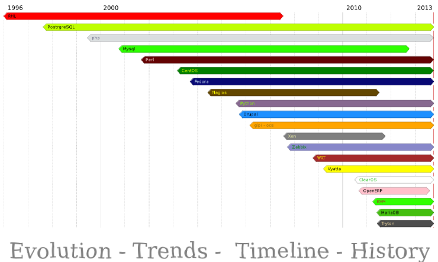
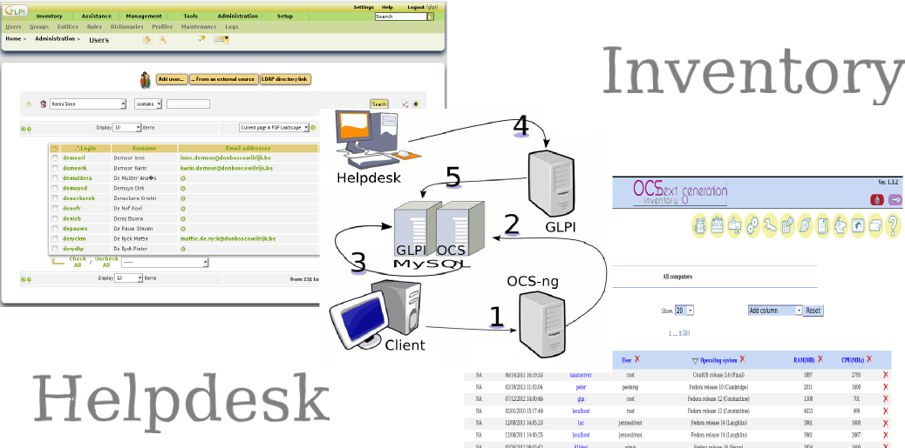
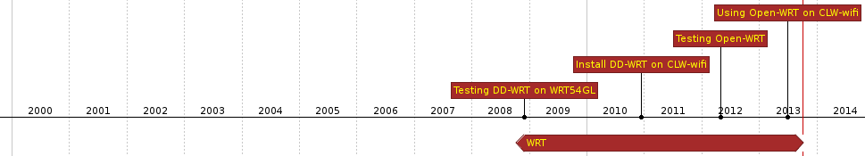

:data-transition-duration: 2000
:title: Open Source in education
:css: css/clw.css

.. _titlepage:

----

:id: titlepage

:data-x: 0
:data-y: 0
:data-scale: 1

.. figure:: images/title_page.png
    :width: 1024px
    :height: 600px

.. note::
    
 - Welkom
 - Geen technisch talk, overzicht van OSS in onze school
 - 15 jaar samen te vatten in 50 min, halve sec/dag
 - rode draad -> tijdlijn: evolutie = exponentieel , densiteit
 - waarover:
     - ondersteundende applicaties
     - servers, virtualisatie en private cloud
     - netwerkapparatuur, routers en wifi
     - helpdesk, inventarisatie en monitoring

 - waarover niet:
     - desktops en bijbehorende applicaties
     - onderwijs-software, zoals wisa, schol en smartschool...
 
----

:id: diff_OS

:data-x: r1600
:data-y: r0

.. image:: images/platforms.png

.. note::

  - waarom Linux OS
  - OS en vrouwen

----

:id: Software

:data-x: r1600
:data-y: r0
:data-scale: 1

.. code:: python

 #!/usr/bin/python
 # Filename: species.py

 class species:
 '''Conventions Used in This Presentation'''
	       
	def __init__(self, sex):
		'''Initializes the species data.'''
		self.sex = sex
		print '(Initializing %s)' % self.sex
		
	def __female__(self):

		if Species.sex == male:
			print 'calm down, it\'s easy'
		else:
			print 'oh dear, this is a more complex situation'
                        mom = dad
                        sister = brother
                        sweetheart = loverboy
                        wife == husband

.. image:: images/white.png
    :width: 1024px
    :height: 25px

.. image:: images/timeline_lang.png
    :width: 1024px
    :height: 175px

.. note::

 - open source
 - broncode aanpassen
 - hoe software werkt
 - software hergebruiken
 
----

:id: Security

:data-x: r1600
:data-y: r0

**Open Source**

*and*

**Security**

.. image:: images/security_db.png
    :width: 600px
    :height: 450px

.. note::

 - veiligheid open code
 - tools
 - Veiligste OS, beste sysadmin
 - tips
  
----

:id: history

:data-x: r1600
:data-y: r0

Evolutie en Continuïteit 
........................

.. note::

 - ups en downs
 - leerkurve
 - eigenschappen
 
----

:id: redhat

:data-x: r1600
:data-y: r0

.. image:: images/rhl_fedora_centos.png
    :width: 450px
    :height: 150px

.. image:: images/white.png
    :width: 1024px
    :height: 100px

.. image:: images/timeline_rhl.png
    :width: 1024px
    :height: 350px

.. note::

 - RHL/CentOS 
 - history  
    
----

:id: zabbix

:data-x: r1600
:data-y: r0

.. image:: images/zabbix.png
    :width: 1024px
    :height: 500px

.. image:: images/white.png
    :width: 1024px
    :height: 25px

.. image:: images/timeline_zabbix.png
    :width: 1024px
    :height: 175px

.. note::

 - Monitoring
   
----

:id: glpi

:data-x: r1600
:data-y: r0

.. image:: images/white.png
    :width: 1024px
    :height: 50px

.. image:: images/timeline_glpi.png
    :width: 1024px
    :height: 100px

.. note::

 - helpdesk:
 - OCS
 - GLPI
     
----

:id: kvm

:data-x: r1600
:data-y: r0

.. image:: images/kvm_overview.png
    :width: 1024px
    :height: 400px

.. image:: images/white.png
    :width: 1024px
    :height: 50px

.. image:: images/timeline_kvm.png
    :width: 1024px
    :height: 250px

.. note::

 - Virtualiseren:
 - XEN
 - KVM
 - Opennebula
 
----

:id: wrt

:data-x: r1600
:data-y: r0

.. image:: images/openwrt.png
    :width: 1024px
    :height: 300px

.. image:: images/white.png
    :width: 1024px
    :height: 100px

.. note::

 - WRT
 - DD-WRT
 - OpenWRT

----

:id: vyatta

:data-x: r1600
:data-y: r0

.. image:: images/vyatta.png
    :width: 1024px
    :height: 500px

.. image:: images/white.png
    :width: 1024px
    :height: 50px

.. image:: images/timeline_vyatta.png
    :width: 1024px
    :height: 100px
  
.. note::

  - Vyatta
   
----

:id: clearos

:data-x: r1600
:data-y: r0

.. image:: images/clearos_features.png
    :width: 1024px
    :height: 500px

.. image:: images/white.png
    :width: 1024px
    :height: 25px

.. image:: images/timeline_clearos.png
    :width: 1024px
    :height: 225px

.. note::

 - ClearOS als SBS
 - ClearOS vs Zentyal
 - applicaties 
     
----

:id: tryton

:data-x: r1600
:data-y: r0

.. image:: images/tryton_view.png
    :width: 1024px
    :height: 500px

.. image:: images/white.png
    :width: 1024px
    :height: 25px

.. image:: images/timeline_tryton.png
    :width: 1024px
    :height: 175px

.. note::

 - ERP (Enterprise Resource Planning)
 - tryton vs openerp vs SAP
 - tryton modules
   
----

:id: ansible

:data-x: r1600
:data-y: r0

.. image:: images/ansible_full.png
    :width: 1024px
    :height: 500px

.. image:: images/white.png
    :width: 1024px
    :height: 25px

.. image:: images/timeline_ansible.png
    :width: 1024px
    :height: 175px

.. note::

 - config management 
 - puppet vs ansible 

  
----

:id: owncloud

:data-x: r1600
:data-y: r0

.. image:: images/owncloud.png
    :width: 1024px
    :height: 500px

.. image:: images/white.png
    :width: 1024px
    :height: 50px

.. image:: images/timeline_owncloud.png
    :width: 1024px
    :height: 150px

.. note::

 - Owncloud
  
----

:id: presentation

used software for this presentation
-----------------------------------

  - python hovercraft https://pypi.python.org/pypi/hovercraft/
  - timeline http://thetimelineproj.sourceforge.net/
  - inkscape http://inkscape.org/
  - reStructuredText, impress.js, git, vim, firefox, .... on Fedora 19

Wii presenter tool
------------------

  - wiipresent http://dag.wieers.com/home-made/wiipresent/

.. image:: images/white.png
    :width: 1024px
    :height: 25px

.. image:: images/timeline_used_software.png
    :width: 1024px
    :height: 200px

----

:id: persistence

:data-x: r1600
:data-y: r0

.. image:: images/persistence_04.jpg
    :width: 800px
    :height: 600px

