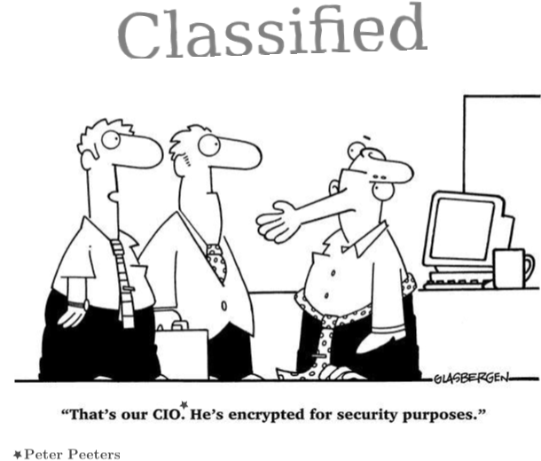
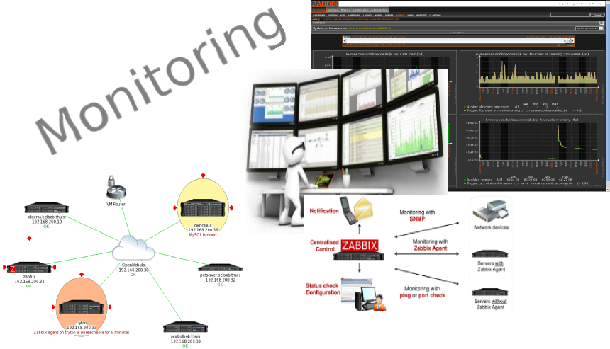
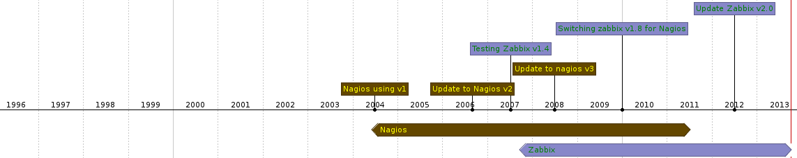
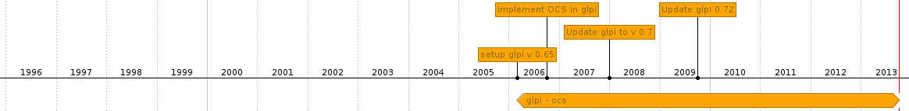
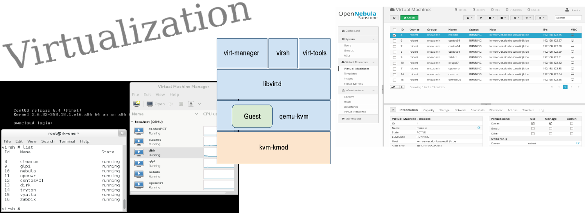
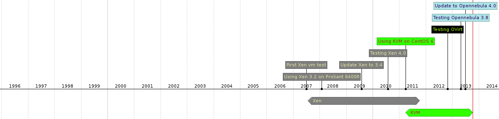
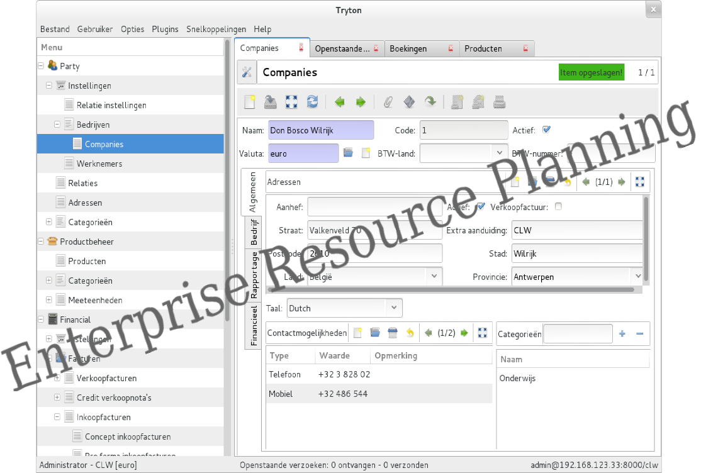
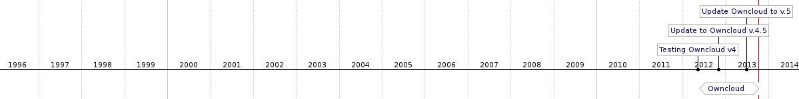

:data-transition-duration: 2000
:title: Open Source in education
:css: css/clw.css

.. _titlepage:

----

:id: titlepage

:data-x: 0
:data-y: 0
:data-scale: 1

.. figure:: images/title_page.png
    :width: 1024px
    :height: 600px

.. note::
    
 - Welkom, wie ben ik
    - Honderd-bunder-bos en vandaag ben ik de verteller.
    - CLW -> deeltijds werken en leren
    - Hard-en software/ netwerktechnieken nu PC-Technieken sinds vorige eeuw, niet aanwezig op de ark van noach

 - Wie zit er in de zaal:Winnie de Poeh, Knorretje, Teigetje...
 - Geen technisch talk, overzicht van OSS in onze school, vertel huidige toestand
 - ga trachten 15 jaar samen te vatten in 50 min, dus goeie halve sec/dag, here we go
 - rode draad -> tijdlijn: evolutie = exponentieel , zie densiteit lijntjes
 - waarover:
     - ondersteundende applicaties
     - servers, virtualisatie en private cloud
     - netwerkapparatuur, routers en wifi
     - helpdesk, inventarisatie en monitoring

 - waarover niet:
     - desktops en bijbehorende applicaties
     - onderwijs-software, zoals wisa, schol en smartschool...
 
 - vragen: wie uit onderwijs, wie gebruikt Linux/OSS
 - persoonlijk vraag stellen, zijn er dames in de zaal 
     - of dat is spijtig
     - of verontschuldiging voor een eventuele seksistisch grap

----

:id: diff_OS

:data-x: r1600
:data-y: r0

.. image:: images/platforms.png

.. note::

 - waarom Linux als OS?
 - geen vergelijking maken tussen wat dan ook, uitgezonderd:
 - vergelijking OS en vrouwen
    - MS => Schoonmoeder, ze stelt veel vragen, geeft je ongevraagd goed bedoelde raad, en als je dan doet wat ze vraagt loopt het veelal mis
    - Apple => Vakantieliefje, mooi, duur, niet compatibel, maar toch voor sommige onder ons onweerstaanbaar
    - Google => Zuster, ze wil alles weten en loopt nogal eens in de weg, maar heeft een goed hart
    - Linux => Je vrouw, meestal onbegrijpelijk, gemiddelde looks, hard werkend, soms zeer complex, maar wel de moeite waard 

 - OEPS, vergeten dat er dames in de zaal zitten, sorry, sorry, maar ik zal het goed maken
 - Laat me even duidelijk zijn, Open Source is geen religie, dus mensen die een ander OS/Software gebruiken gaan NIET per definitie naar de hel. 

----

:id: Software

:data-x: r1600
:data-y: r0
:data-scale: 1

.. code:: python

 #!/usr/bin/python
 # Filename: species.py

 class species:
 '''Conventions Used in This Presentation'''
	       
	def __init__(self, sex):
		'''Initializes the species data.'''
		self.sex = sex
		print '(Initializing %s)' % self.sex
		
	def __female__(self):

		if Species.sex == male:
			print 'calm down, it\'s easy'
		else:
			print 'oh dear, this is a more complex situation'
                        mom = dad
                        sister = brother
                        sweetheart = loverboy
                        wife == husband

.. image:: images/white.png
    :width: 1024px
    :height: 25px

.. image:: images/timeline_lang.png
    :width: 1024px
    :height: 175px

.. note::

 - software vorige dia was miserabel, maar wel open source
 - we kunnen nu op een eenvoudige manier de broncode aanpassen
 - we kunnen zelfs zien hoe de software werkt
 - en software hergebruiken, ...
 - Maar... werkt deze software? Foutjes, of gewoon crap ...
     - hopelijk ziet iemand fouten (vrouw wordt man)
     - ok, iemand kan me helpen, deze software wordt goed met zoveel hulp
     - ieder heeft zijn specialiteiten, devs, ops, usr, iedereen kan helpen
     - community is geboren
     - vergeet bij het schrijven van oss dus niet alles te delen vanaf de eerste lijn code, het rendeert zeker

 - dit geeft studenten die leren programmeren vleugels
 - pedagogisch comfort, kijken naar goeie code, is leren van een professionals 
 
----

:id: Security

:data-x: r1600
:data-y: r0

**Open Source**

*and*

**Security**

.. note::

 - En dan is er (nee geen koffie) security
 - belangrijkste vorm van veiligheid is het open zijn van de code
 - tools
     - Firewall , iptables, Firewalld,..
     - SELinux, Intrusion systems, IPSec, DNSsec, ...
     - teveel om op te noemen

 - Linux veiligste OS?
     - foute vraag
     - wie heeft de beste sysadmin
     - kennis van je systemen en ze kunnen doorgronden -> belangrijk

 - tips
     - Sterke passwoorden
     - maak geen gebruik van root, NOOIT, niet nodig
     - gebruik secure service en certificaten, https, pops,...
     - encryptie voor je disks bij bedrijfs-gerelateerde data

----

:id: history

:data-x: r1600
:data-y: r0

.. image:: images/timeline_overview.png
    :width: 1024px
    :height: 650px

Evolutie en Continuïteit 
........................

.. note::

 - Rome is niet op een dag gebouwd, onze IT ook niet
 - het lijkt erop dat er bepaalde periodes totaal niets veranderd is, maar dat is niet zo 
    - veel ups en downs, volhouden is dan de boodschap
    - leerkurve was is niet altijd vlak
 
 - alle nu nog gebruikte apllicaties hebben volgende eigenschappen:
    - eenvoudig te beheren (yum - ansible)
    - schaalbaar
    - kleine leerkurve
    - open source en dus aanpasbaar aan onze wensen
 
----

:id: redhat

:data-x: r1600
:data-y: r0

.. image:: images/rhl_fedora_centos.png
    :width: 450px
    :height: 150px

.. image:: images/white.png
    :width: 1024px
    :height: 100px

.. image:: images/timeline_rhl.png
    :width: 1024px
    :height: 350px

.. note::

 - waarom RHL/CentOS (Community Enterprise Operating System)
    - Geen idee, ik weet het niet meer (betere optie was Slackware..??)
    - andere distros zijn even goed (soms beter), kwestie van gevoel...  
 
 - history:   
    - reeds 15j Linux (redhat -> centos)
    - 1997 RedHat 5 eerste ftp en apache server
    - 2001 RedHad 7.2 desktop met gnome2 en samba server
    - 2003 RedHat 9 desktop en server
    - 2005 CentOS 3,4 
    - CentOS 5 mainserver en huidige 6.4 (kvm, opennebula en wks)

 - toegevoede waarde: 
    - compatibel met RHEL/Scientific/Fermi/Springdale(Puias) (voordeel ???)
    - goede std config files
    - eenvoudig install en update met yum
    - duurzaamheid, lange termijn gebruik (min. levensduur hardware, 7 jaar ”full updates”)
    - technish sterke community
    - goede documentatie (Redhat)
    - Fedora geeft je de kans om al even vooruit te kijken naar volgende release
    - en CentOS Project is veel meer dan een de CentOS Distro 
 
----

:id: zabbix

:data-x: r1600
:data-y: r0

.. image:: images/white.png
    :width: 1024px
    :height: 25px

.. note::

 - Waarom Monitoring
    - al snel de noodzaak van monitoring (problemen met netwerk en smcrouter, nee niet de fout van onze RHL-file server)
    - nagios, complex, elke keer moeilijk om nieuwe service/machine toe te voegen
    - zabbix, en zoals Kris zegt, beter zabbix dan geen monitoring
    - zeer eenvoudig op te zetten
    - monitoring zonder te moeilijke settings
    - eenvoudig services/machines toe te voegen 
    - bruikbaar in een kleine omgeving, ik moet niet alles in het detail weten, soms is het gewoon voldoende dat je weet dat vb. een AP nog online is, of dat een printer toner nodig heeft. dat kan je met een blik op het scherm zien.
    - manieren om iets te detecteren:
       - snmp
       - client
       - ping, port check,... cli tools..

 - Toegevoegde waarde:
      - veel problemen worden opgelost voor de systeemgebruiker ze merkt
      - database van voorkomende problemen en hoe opgelost
      - grafisch overzicht van systeemstatus (voor iedereen)

----

:id: glpi

:data-x: r1600
:data-y: r0

.. image:: images/glpi_ocs.png
    :width: 1024px
    :height: 550px

.. image:: images/white.png
    :width: 1024px
    :height: 50px

.. note::

 - Waarom helpdesk:
     - nood aan inventarisatie van onze systemen (verzekering)
     - nood aan ticketing-systeem
     - nood aan documentatie van systemen, routers, software
     - nood aan opvolgen uitlenen van materiaal

 - OCS
     - inventarisatie server
     - OCS client (hardware - devices - software)

 - GLPI
     - inventarisatie
          - hardware & connect devices & software
     - helpdesk
          - tickets
          - planning
     - tools
          - documentatie-kennis-databank (conf files, install docs,... )  
          - reservaties
          - reporting pdf, graphs
     - Administration
          - sync met OCS en ldap servers
    
----

:id: kvm

:data-x: r1600
:data-y: r0

.. image:: images/white.png
    :width: 1024px
    :height: 50px

.. note::

 - Waarom virtualiseren:
     - eenvoudiger beheer
     - hardware beter benutten 
     - besparen op kosten/hardware/energie
 - XEN (std CentOS 5)
     - paravirtualistatie op oude Compaqs Proliant 6400R
     - stabiel, goeie prestaties
 - KVM (std CentOS 6)
     - full virtualisation op x86_64 met VT
     - virsh 
     - desktop virtualisatie
 - Opennebula: logische stap naar private Cloud 
     - waarom: infrastructuur virtualiseren en eenvoudig schaalbaar
     - Ovirt vs Proxmox vs OpenNebula vs OpenStack
     - waarom opennebula cloud:
         - virtualiseren, meerdere hypervisors mogelijk
         - eenvoudige HA (met verschillende hypervisors)
         - eenvoudig schaalbaar, uit te breiden met extra host (capaciteit)
         - extra host op andere lokatie, vb. klasje met virtuele desktops 
         - zeer bruikbare cli, ansible playbooks

----

:id: wrt

:data-x: r1600
:data-y: r0

.. image:: images/openwrt.png
    :width: 1024px
    :height: 300px

.. image:: images/white.png
    :width: 1024px
    :height: 100px

.. image:: images/timeline_wrt.png
    :width: 1024px
    :height: 100px

.. note::

 - Waarom WRT
     - ontevreden over snelheid/stabiliteit van wifi-router (WRT54-GL)
     - geen bruikbare cli, slechte webinterface
     - geen buget voor een betere wifi-apparatuur

 - DD-WRT54 (cisco E-1000)
     - eenvoudig webinterface
     - uitgebreide mogelijkheden
     - stabiel en snel 
     - gevoel, loopt op zijn einde....?

 - OpenWRT (TP-link WDR4300)
     - veel betere/mooiere software
     - uitgebreide hardware ondersteuning
     - bruikbare radius-client
     - goeie community
     - echte cli en bruikbare uci (Unified Configuration Interface)
     - veel extra software, vb zabbix client, radiusserver...
     - te beheren met ansible

----

:id: vyatta

:data-x: r1600
:data-y: r0

.. image:: images/vyatta.png
    :width: 1024px
    :height: 500px

.. image:: images/white.png
    :width: 1024px
    :height: 50px

.. image:: images/timeline_vyatta.png
    :width: 1024px
    :height: 100px
  
.. note::

 - Waarom Vyatta
    - geen budget om een fatsoenlijke router aan te schaffen
    - huis tuin en keuken smc voldeed niet
    - Compaq Proliant 6400R met 12 nics aanwezig

 - Vyatta (Debian based):
    - fantastische cli (vergelijkbaar CLI Cisco IOS)
    - zeer uitgebreide mogelijkheden
       - noem maar op....BGP, Firewall, NAT, OSPF, BPR, RIP, VPN...
       - ....echt al wat je van een Enterprise Router mag verwachten
    - perfect als virtuele router  
    - Zeer uitgebreide documentatie   
    - -1 -> geen vrije web-gui, om vlot te werken heb je die niet nodig
  
----

:id: clearos

:data-x: r1600
:data-y: r0

.. image:: images/clearos_features.png
    :width: 1024px
    :height: 500px

.. image:: images/white.png
    :width: 1024px
    :height: 25px

.. image:: images/timeline_clearos.png
    :width: 1024px
    :height: 225px

.. note::

 - Waarom ClearOS als SBS
     - webbased systeem beheer
     - zeer eenvoudig op te zetten
     - ClearOS is CentOS based

 - ClearOS vs Zentyal (dezelfde functionaliteit/applicaties)
 - applicaties 
     - services:
         - backup, cups, mysql, directory, web, ftp, mail
     - network 
         - firewall, ntp, dns, dhcp, radius, vpn, ...
     - gateway
         - content filter, web proxy, web access control,..
     - systeembeheer
         - users, groups, policies,.. 

 - toegevoegde waarde:
     - toekomst , nieuwe sysadmin kan starten zonder kennis van Linux en de cli
     - Eenvoudig beheer van de basis-serverapplicaties

----

:id: tryton

:data-x: r1600
:data-y: r0

.. image:: images/white.png
    :width: 1024px
    :height: 25px

.. image:: images/timeline_tryton.png
    :width: 1024px
    :height: 175px

.. note::

 - Waarom ERP (Enterprise Resource Planning)
     - vraag naar centrale database bedrijfsgegevens (vb. magazijnbeheer, )

 - tryton vs openerp vs SAP
     - alle drie ong dezelfde functionaliteit
     - SAP (bedrijjf) grote bedrijven , geen OSS
     - OpenERP, raar idee over OpenSource, beperking v7
     - fork van OpenERP, minder modules, maar zeker voldoende

 - tryton modules
     - CRM (Customer Relationship Management)
     - Productbeheer (bestelbon, prijsoffertes, ..)
     - Financieel (aankoopbonnetjes, aankoopfacturen, ..)
     - Inventaris, stockbeheer
     - Timesheets, Project-planning
     - en nogveelmeer..

  - toegevoegde waarde:
     - zelf iets bouwen is zeer tijdrovend
     - zelfs een module gebruiken is de moeite waard

----

:id: ansible

:data-x: r1600
:data-y: r0

.. image:: images/ansible_full.png
    :width: 1024px
    :height: 500px

.. image:: images/white.png
    :width: 1024px
    :height: 25px

.. image:: images/timeline_ansible.png
    :width: 1024px
    :height: 175px

.. note::

 - waarom config management 
    - nood aan centraal config beheer
    - veel zelfde taken op verschillende machines uitvoeren
    - een betere/andere oplossing dan gebruik terminator

 - puppet vs ansible 
    - puppet (T-Dose 2011 - Kris buytaert)
         - server based (or local puppet)
         - manifest based
         - moeilijk
    - ansible (T-Dose 2012 - Dag Wieers)
         - Low overhead 
         - playbook based
         - zeer envoudig 
          
 - toegevoegde waarde:
     - tijdbesparing
     - voor ons perfect in combinatie met cobbler of fog

----

:id: owncloud

:data-x: r1600
:data-y: r0

.. image:: images/owncloud.png
    :width: 1024px
    :height: 500px

.. image:: images/white.png
    :width: 1024px
    :height: 50px

.. note::

 - waarom owncloud
     - alternatief voor dropbox
     - bestanden in eigen beheer

 - owncloud extra's:
     - versiebeheer
     - sync database
     - share data
     - web based user interface
     - clients for Linux, Apple and mS
 

 - Toegevoegde waarde:
     - delen van foto's, video en muziek
     - sync documenten laptop naar server

----

:id: presentation

used software for this presentation
-----------------------------------

  - python hovercraft https://pypi.python.org/pypi/hovercraft/
  - timeline http://thetimelineproj.sourceforge.net/
  - inkscape http://inkscape.org/
  - reStructuredText, impress.js, git, vim, firefox, .... on Fedora 19

Wii presenter tool
------------------

  - wiipresent http://dag.wieers.com/home-made/wiipresent/

.. image:: images/white.png
    :width: 1024px
    :height: 25px

.. image:: images/timeline_used_software.png
    :width: 1024px
    :height: 200px

----

:id: persistence

:data-x: r1600
:data-y: r0

.. image:: images/persistence_04.jpg
    :width: 800px
    :height: 600px

----

:data-x: r1600
:data-y: r0

.. image:: images/people_circle02.png
    :width: 800px
    :height: 500px

.. note::

    - community bestaat uit mensen (users, devs en ops)
    - mensen zijn eenvoudig aanspreekbaar (over heel de wereld)
        - chat, mail, forum, twitter, ....
        - events (Fosdem, T-Dose, FrosCon, ..)
    - vb. 50 sprekers in onze school de laatste 2j op onze events:
        - Fedora release party
        - Loadays
        - centos dojo day
        - ansible meeting 
    - spreken is zo belangrijk, maar de echte truc is DevOps:
        #. devs,  de software ontwikkelaars (software schrijven)
        #. devops (devs en ops werken continu samen naar betere software, systemen, sushi en bier)
        #. ops , de systeemadmins (naar productie) 
        #. devops is veel meer dan deze 3 bovenstaande regels, er worden events en conferences over gehouden..  
        

----

:data-x: r1600
:data-y: r0

.. image:: images/cooperators_02.png
    :width: 800px
    :height: 500px

.. note::
   
      - De mensen werken meestal voor bedrijven
      - bedrijven in de oss
      - directe omgeving 

